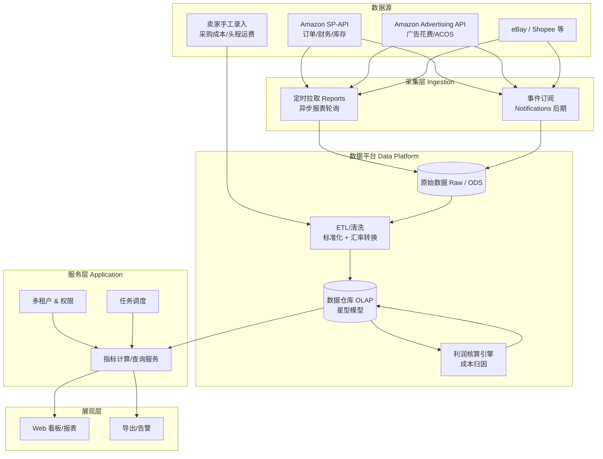
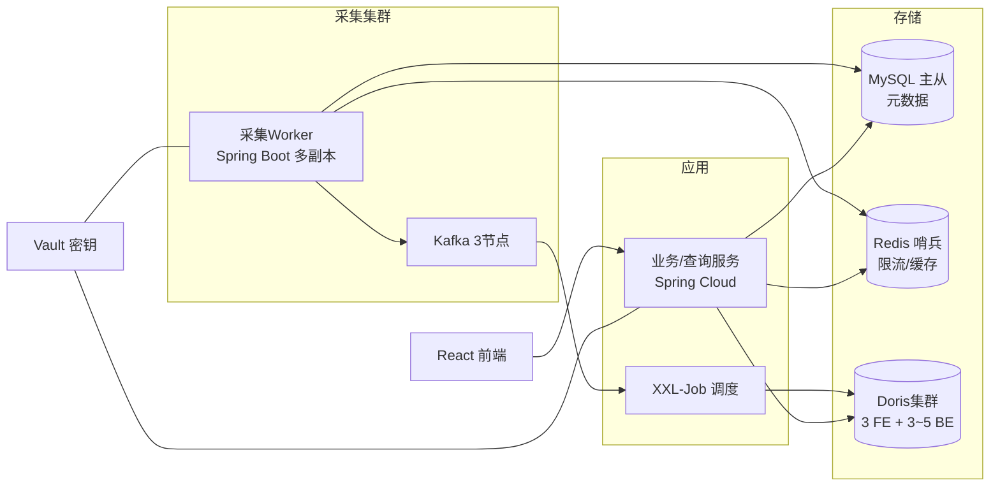
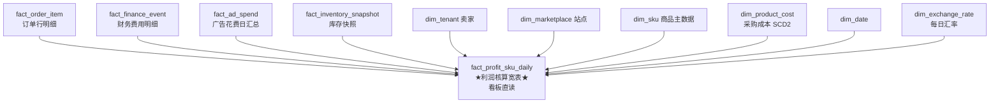

# 亚马逊卖家 BI 工具 —— 技术方案选型

本文档记录「亚马逊卖家销售业务分析」SaaS BI 工具的技术分析、架构设计与最终技术选型过程，作为后续开发的基础依据。业务背景详见 [`README.md`](./README.md)。

---

## 一、需求拆解与核心技术挑战

从业务痛点出发，将需求映射为具体的技术挑战：

| 业务痛点 | 对应技术挑战 |
|---|---|
| 数据孤岛（多平台） | 多数据源接入 + 统一数据模型（SP-API / Advertising API / eBay / Shopee 各不相同） |
| 利润核算极复杂 | **成本归因引擎**：把十几项费用摊到 SKU/订单粒度 + 多币种汇率换算 |
| 决策需要数据支撑 | OLAP 多维分析 + 关键指标（ACOS、库存周转率、流量转化率） |
| SaaS 软件 | 多租户隔离、亚马逊数据合规（DPP）、弹性伸缩 |

> **关键认知**：广告数据（ACOS 的来源）**不在 SP-API 中**，而在独立的 **Amazon Advertising API**。这是两套完全独立的鉴权、限流与报表体系，做利润核算与 ACOS 必须同时接入这两个 API。

---

## 二、项目约束条件（决定选型档次）

| 约束 | 结论 |
|---|---|
| 团队技术栈 | **全 Java 开发人员** |
| 初期规模 | **约 800 个卖家**；最大单店 **2 万单/天** |
| 部署环境 | **自建机房**（非公有云） |
| 一期优先级 | **只做亚马逊单平台的利润核算** |

### 规模测算

- 全平台总订单量约在 **百万级/天**。
- 利润核算按「费用条目」存储：一个订单在结算/财务数据中会展开成 **8~15 行**费用明细（佣金、FBA 费、仓储费、广告分摊、退款等）。
- 事实表写入量级 ≈ **千万行/天**，一年 **数十亿行**，2~3 年累积到 **百亿行级**。

**结论**：该量级明确落在 **列存 MPP 数仓** 区间，普通 MySQL 单库做分析不可行；但也未大到需要特殊架构，几节点的列存集群即可支撑。

---

## 三、整体架构分层



**核心思路**：采集与分析解耦。原始数据先落「数据湖/ODS」，再经 ETL 进 OLAP 数仓；利润核算作为独立引擎运行在数仓之上。既保证可追溯（对账时能回到原始记录），又支撑灵活的多维分析。

---

## 四、SP-API 对接要点（项目成败核心）

1. **鉴权**：使用 LWA（Login with Amazon）OAuth 2.0。亚马逊已于 2023 年底取消强制 AWS SigV4/IAM 签名，现仅需 LWA access token。作为 Solution Provider，走卖家 OAuth 授权 → 获取长期 `refresh_token` 调用。
2. **数据主要靠 Reports API（异步）**：`请求报表 → 轮询状态 → 获取文档 → 解密下载（gzip）`。核心报表：结算报表 `GET_V2_SETTLEMENT_REPORT`、订单报表、FBA 库存报表；细粒度费用配合 **Finances API**。
3. **实时性靠 Notifications API**：通过 SQS / EventBridge 订阅事件做增量更新（**一期不做**，见下文自建约束）。
4. **限流（Rate Limit）**：每个接口独立的令牌桶。多租户下需做**分租户限流调度队列**，否则易被封禁。
5. **多区域多站点**：NA / EU / FE 三个 endpoint，卖家可能跨站点经营，`marketplace` 必须是一等维度。
6. **合规（Data Protection Policy）**：买家 PII 需通过 **RDT（Restricted Data Token）** 获取，且要求加密存储、访问日志、保留期限（一般 30 天）。这是过 Amazon 审核的硬门槛，架构初期就要设计 PII 隔离与加密。

---

## 五、技术选型决策过程

### 5.1 OLAP 数仓：Doris vs ClickHouse

结合「利润核算需 JOIN + 更新」「Java 团队」「自建运维」三点约束：

| 对比项 | ClickHouse | Apache Doris ✅ |
|---|---|---|
| 多表 JOIN | 弱 | 强 |
| 数据更新/Upsert | 弱（偏只追加） | 强（Unique 主键 Merge-on-Write） |
| 协议兼容 | 独立方言 | **兼容 MySQL 协议**，Java 团队零学习成本 |
| 自建运维 | 较复杂 | 相对友好（FE/BE） |

> **结论**：利润核算需要多表 JOIN、数据订正回溯，且团队为 Java，**最终选 Apache Doris**。

### 5.2 元数据库：MySQL

- 与 Doris **统一 MySQL 协议**，SQL 操作一致，团队最熟。
- 存储：租户、授权 token、SKU 主数据、成本录入、任务状态等事务性元数据。

### 5.3 通知方案：纯轮询（一期）

亚马逊 Notifications API **只能投递到 AWS SQS / EventBridge**，即使自建机房也无法直推内网。

- **方案 A（一期采用）：纯轮询**。利润核算依赖周期性结算报表 + 增量拉取订单/财务，实时性要求不高，全部走 Reports/Finances API 定时拉取，**零 AWS 依赖**。
- **方案 B（后期）**：在 AWS 挂极小的 SQS 队列作中继，桥接回自建 Kafka。仅当需要秒级库存/订单变更时才做。

> **结论**：一期走纯轮询，降低复杂度与外部依赖。

### 5.4 调度器：XXL-Job

- Java 生态、可自建、中文文档完善，适合定时任务型调度。
- （备选 DolphinScheduler 更偏数据 ETL DAG 编排与数据血缘，本项目一期选 XXL-Job。）

### 5.5 多租户隔离：共享库表 + `tenant_id`

- 800 租户采用 **共享库表 + `tenant_id` 分区 / 行级隔离**，成本最低、最易运维。
- 不采用「一租户一库」的物理隔离（成本高，本项目暂不需要金融级物理隔离）。

---

## 六、最终技术选型（已锁定）

| 层 | 最终选型 | 理由 |
|---|---|---|
| 后端框架 | **Spring Boot + Spring Cloud**（微服务） | 全 Java 团队，零学习成本 |
| 消息队列 | **Apache Kafka** | 自建标准件，扛千万级/天写入削峰解耦 |
| 任务调度 | **XXL-Job** | Java 系、可自建、中文文档好 |
| OLTP 元数据库 | **MySQL 8** | 与 Doris 统一 MySQL 协议 |
| OLAP 数仓 | **Apache Doris** | 强 JOIN/更新、兼容 MySQL、易运维 |
| 缓存/限流 | **Redis** | 热点指标缓存 + SP-API 分租户令牌桶 |
| 计算引擎 | 一期 **ELT（SQL + 调度）**，二期视情况引入 **Flink** | 结算报表本身周期性批量，一期批处理足够 |
| 通知方案 | **纯轮询** | 一期无 AWS 依赖 |
| 多租户 | **共享库表 + `tenant_id` 分区/行级隔离** | 成本最低、易运维 |
| 密钥/合规 | **HashiCorp Vault** + 加密 + 审计 | 自建替代云 KMS，满足 DPP |
| 前端 | **React + TypeScript + Ant Design + ECharts / AntV** | 看板图表生态最强 |
| 部署 | **Docker + Kubernetes（自建）** + Prometheus/Grafana + ELK | 自建机房需自管编排/监控/日志 |

---

## 七、自建机房部署拓扑（起步规模）



**起步硬件参考**：
- Doris BE：大内存 + SSD（每节点约 128G 内存 / 十几核 / 数 TB SSD），3~5 台 BE 起步。
- Kafka：3 节点。
- 其余服务在 K8s 上多副本运行。
- 百亿行级数据压缩后约 **几 TB**，SSD 完全够用。

---

## 八、利润核算数仓设计（星型模型）

### 8.1 Doris 数据模型选择

- **Duplicate（明细追加）**：只追加、不更新的原始明细（订单行、财务事件）。
- **Unique（主键 Upsert / Merge-on-Write）**：会被修正/回溯的数据（结算修正、退款、广告归因窗口回填）。
- **Aggregate（预聚合）**：给看板直读的利润宽表（按 SUM 预聚合）。

### 8.2 星型模型总览



### 8.3 表清单（粒度 / 模型 / 数据来源）

| 表 | 粒度 | Doris 模型 | 来源 |
|---|---|---|---|
| `dim_tenant` | 卖家 | Unique | MySQL 元数据同步 |
| `dim_marketplace` | 站点 | Unique | 配置 |
| `dim_sku` | 租户+SKU | Unique | SP-API Listings + 卖家维护 |
| `dim_product_cost` | 租户+SKU+生效期 | Unique | 卖家录入（采购成本随时间变化，SCD2） |
| `dim_exchange_rate` | 币种对+日期 | Unique | 汇率源每日拉取 |
| `dim_date` | 日期 | Duplicate | 预生成 |
| `fact_order_item` | 订单行 | **Unique**（订单状态会变） | SP-API Orders/Reports |
| `fact_finance_event` | 每笔费用 | **Duplicate**（事件流） | SP-API Finances/结算报表 |
| `fact_ad_spend` | 租户+日期+SKU/广告 | **Unique**（归因窗口回填） | Advertising API（二期） |
| `fact_inventory_snapshot` | 租户+SKU+日期 | Unique | FBA 库存报表 |
| `fact_profit_sku_daily` | 租户+站点+SKU+日期 | **Aggregate** | XXL-Job ELT 计算生成 |

### 8.4 核心表 DDL 示例（Doris 语法）

财务费用明细——利润核算最核心的数据，`tenant_id` 作为分桶键 + 按日期分区：

```sql
CREATE TABLE fact_finance_event (
    tenant_id       BIGINT       NOT NULL COMMENT '租户ID(行级隔离)',
    marketplace_id  INT          NOT NULL,
    event_date      DATE         NOT NULL,
    order_id        VARCHAR(64)  NOT NULL,
    sku             VARCHAR(128) NULL,
    event_type      VARCHAR(32)  NOT NULL COMMENT 'ShipmentEvent/RefundEvent/ServiceFee...',
    fee_type        VARCHAR(64)  NOT NULL COMMENT 'Commission/FBAPerUnitFulfillmentFee/Storage...',
    amount          DECIMAL(18,4) NOT NULL COMMENT '原币金额(费用为负)',
    currency        VARCHAR(8)   NOT NULL,
    settlement_id   VARCHAR(64)  NULL,
    ingest_time     DATETIME     NOT NULL
)
DUPLICATE KEY(tenant_id, marketplace_id, event_date, order_id)
PARTITION BY RANGE(event_date) ()
DISTRIBUTED BY HASH(tenant_id) BUCKETS 32
PROPERTIES (
    "dynamic_partition.enable" = "true",
    "dynamic_partition.time_unit" = "MONTH",
    "replication_num" = "3"
);
```

看板直读的利润宽表——Aggregate 预聚合，查询按 `tenant_id` 命中分桶：

```sql
CREATE TABLE fact_profit_sku_daily (
    tenant_id        BIGINT       NOT NULL,
    marketplace_id   INT          NOT NULL,
    stat_date        DATE         NOT NULL,
    sku              VARCHAR(128) NOT NULL,
    sales_amount     DECIMAL(18,4) SUM DEFAULT "0" COMMENT '销售收入',
    platform_fee     DECIMAL(18,4) SUM DEFAULT "0" COMMENT '平台佣金+FBA费',
    refund_amount    DECIMAL(18,4) SUM DEFAULT "0",
    ad_cost          DECIMAL(18,4) SUM DEFAULT "0",
    cogs             DECIMAL(18,4) SUM DEFAULT "0" COMMENT '采购成本',
    inbound_freight  DECIMAL(18,4) SUM DEFAULT "0" COMMENT '头程运费分摊',
    storage_fee      DECIMAL(18,4) SUM DEFAULT "0",
    tax_amount       DECIMAL(18,4) SUM DEFAULT "0",
    net_profit       DECIMAL(18,4) SUM DEFAULT "0" COMMENT '净利润',
    order_qty        BIGINT        SUM DEFAULT "0"
)
AGGREGATE KEY(tenant_id, marketplace_id, stat_date, sku)
PARTITION BY RANGE(stat_date) ()
DISTRIBUTED BY HASH(tenant_id) BUCKETS 32
PROPERTIES (
    "dynamic_partition.enable"="true",
    "dynamic_partition.time_unit"="MONTH",
    "replication_num"="3"
);
```

### 8.5 利润公式 → 表字段映射（核算引擎逻辑）

XXL-Job 定时执行的 ELT 本质是这条链路：

```
净利润 net_profit =
    sales_amount            ← fact_order_item (principal 售价)
  − platform_fee            ← fact_finance_event (Commission/FBA费, 按 fee_type 聚合)
  − refund_amount           ← fact_finance_event (RefundEvent)
  − ad_cost                 ← fact_ad_spend (按 SKU 归因)
  − cogs                    ← dim_product_cost (按 order_date 匹配生效期) × order_qty
  − inbound_freight         ← 头程分摊规则 × order_qty
  − storage_fee             ← fact_finance_event (Storage)
  − tax_amount              ← fact_order_item (tax) / VAT
  ± 汇率换算               ← dim_exchange_rate (原币 → 记账本位币)
```

两条建模阶段必须定好的规则：
1. **时间口径**：所有费用统一归属到哪一天？建议按 **订单发生日（purchase_date）** 归集，广告与结算通过 order/日期回填对齐。
2. **成本分摊**：`dim_product_cost` 用 **SCD2（生效日期区间）** 存历史采购价；头程运费需一张可配置的 **分摊规则表**（按数量/重量/体积，一期默认按销售数量分摊）。

### 8.6 多租户 + Doris 固定约定

- **`tenant_id` 一律作为 key 首列 + `DISTRIBUTED BY HASH(tenant_id)`**：同租户数据落同一批 bucket，查询天然只扫本租户数据，兼顾隔离与性能。
- **所有查询强制带 `tenant_id` 过滤**：在数据访问层（MyBatis 拦截器 / Mapper 基类）统一注入，杜绝越权。
- **按日期动态分区**：便于历史数据生命周期管理与分区裁剪。

---

## 九、建议的开发落地路线

1. **MVP**：单站点 SP-API 授权 → 拉结算+订单报表 → 入 MySQL/Doris → 「销售/利润概览」看板，先打通「授权→采集→核算→展示」闭环。
2. **迭代二**：接入 Advertising API，做 ACOS / 广告利润归因。
3. **迭代三**：完善成本录入（COGS、头程）、多币种、库存周转率。
4. **迭代四**：多站点/多平台、告警、多租户与合规加固（PII 加密、审计）。

开发切入顺序：**① Spring Boot + MySQL + Doris 工程骨架 → ② SP-API 授权与结算报表采集 → ③ 利润核算 ELT Job → ④ 概览看板**。

---

## 十、待确认事项

1. **时间口径**：确认按「订单发生日（purchase_date）」归集利润。
2. **头程运费分摊**：一期默认「按销售数量分摊」，后续支持按重量/体积可配置。
